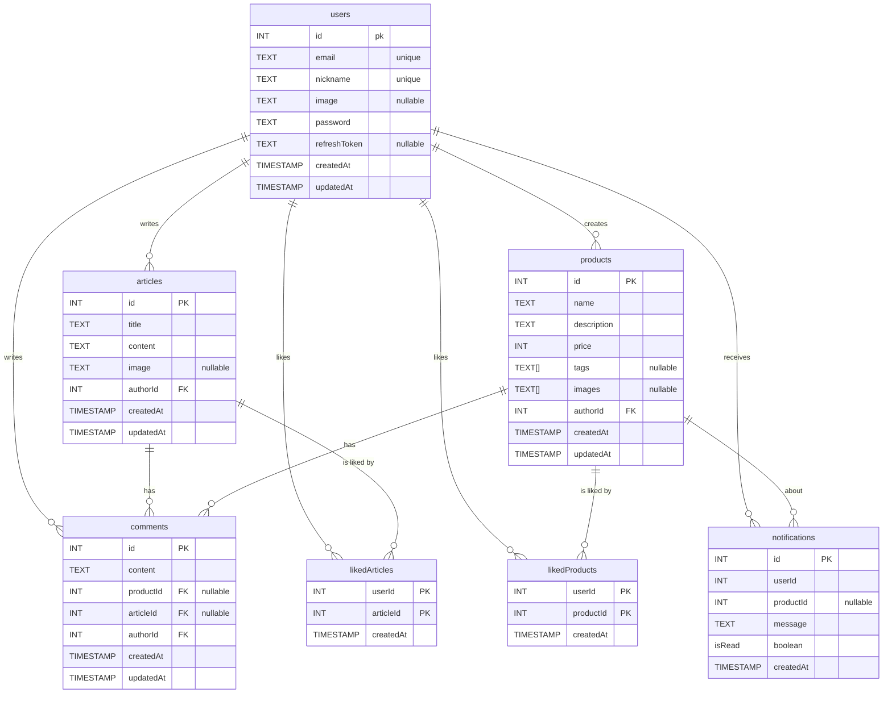

```mermaid
erDiagram
users {
INT id pk
TEXT email "unique"
TEXT nickname "unique"
TEXT image "nullable"
TEXT password
TEXT refreshToken "nullable"
TIMESTAMP createdAt
TIMESTAMP updatedAt
}

articles {
INT id PK
TEXT title
TEXT content
TEXT image "nullable"
INT authorId FK
TIMESTAMP createdAt
TIMESTAMP updatedAt
}

products {
INT id PK
TEXT name
TEXT description
INT price
TEXT[] tags "nullable"
TEXT[] images "nullable"
INT authorId FK
TIMESTAMP createdAt
TIMESTAMP updatedAt
}

comments {
INT id PK
TEXT content
INT productId FK "nullable"
INT articleId FK "nullable"
INT authorId FK
TIMESTAMP createdAt
TIMESTAMP updatedAt
}

likedProducts {
INT userId PK
INT productId PK
TIMESTAMP createdAt
}

likedArticles {
INT userId PK
INT articleId PK
TIMESTAMP createdAt
}

notifications {
  INT id PK
  INT userId
  INT productId "nullable"
  TEXT message
  isRead boolean
  TIMESTAMP createdAt
}

users ||--o{ articles : "writes"
users ||--o{ products : "creates"
users ||--o{ comments : "writes"
users ||--o{ likedProducts : "likes"
users ||--o{ likedArticles : "likes"
users ||--o{ notifications : "receives"

articles ||--o{ comments : "has"
articles ||--o{ likedArticles : "is liked by"

products ||--o{ comments : "has"
products ||--o{ likedProducts : "is liked by"
products ||--o{ notifications : "about"
```
