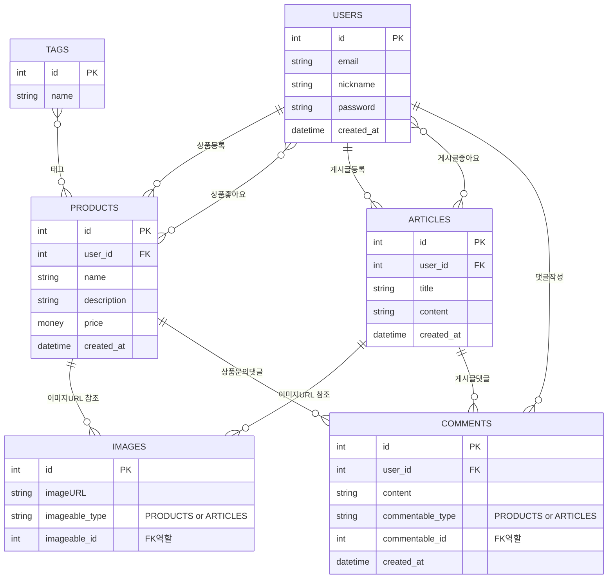

```mermaid
erDiagram
USERS {
int id PK
string email
string nickname
string password
datetime created_at
}

PRODUCTS{
int id PK
int user_id FK
string name
string description
money price
datetime created_at
}

ARTICLES{
int id PK
int user_id FK
string title
string content
datetime created_at
}

COMMENTS{
int id PK
int user_id FK
string content
string commentable_type "PRODUCTS or ARTICLES"
int commentable_id "FK역할"
datetime created_at
}

TAGS{
int id PK
string name
}

IMAGES{
int id PK
string imageURL
string imageable_type "PRODUCTS or ARTICLES"
int imageable_id "FK역할"
}

    USERS ||--o{ PRODUCTS : "상품등록"
    USERS }o--o{ PRODUCTS : "상품좋아요"
    USERS ||--o{ ARTICLES : "게시글등록"
    USERS }o--o{ ARTICLES : "게시글좋아요"
    TAGS }o--o{ PRODUCTS : "태그"
    PRODUCTS ||--o{ IMAGES : "이미지URL 참조"
    ARTICLES ||--o{ IMAGES : "이미지URL 참조"
    PRODUCTS ||--o{ COMMENTS  : "상품문의댓글"
    ARTICLES ||--o{ COMMENTS  : "게시글댓글"
    USERS ||--o{ COMMENTS  : "댓글작성"

```
